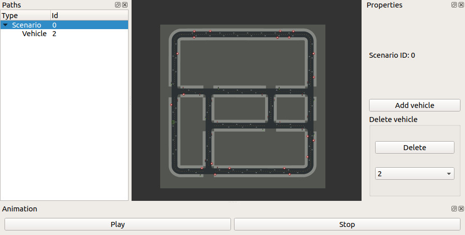
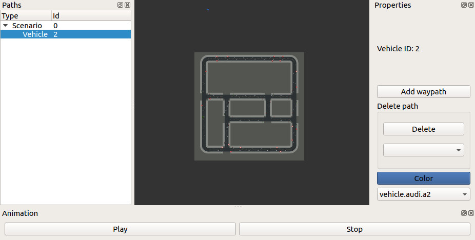
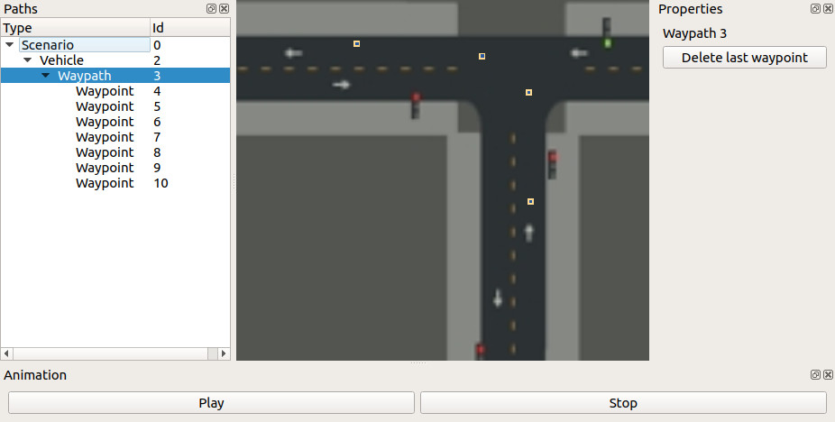
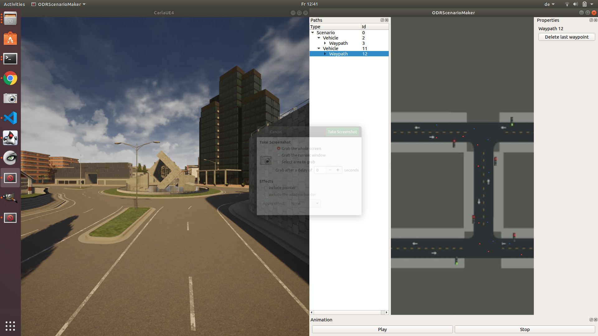
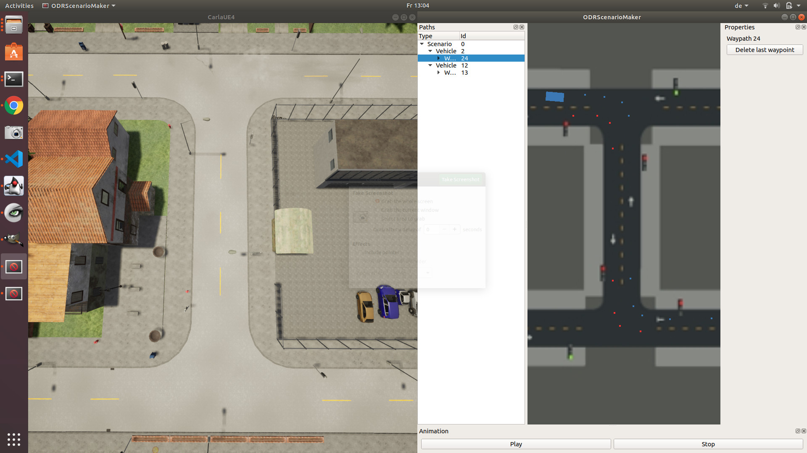
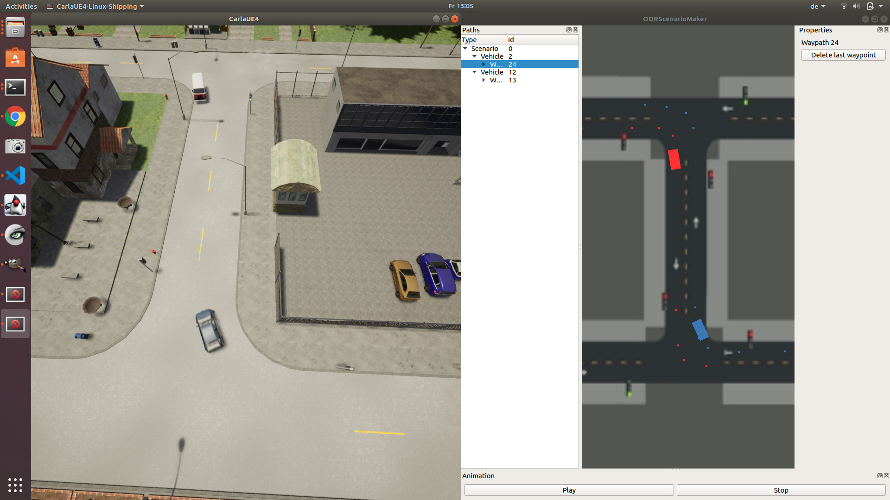

# Steps to compile Carla 0.9.9 and the Examples/CppClient. 
## Legacy way.
This would require clang and ninja installed on the system.
1. Checkout the Carla 0.9.9. **Important!** The master branch has now a bug in commit c45614c983fa72b971dde1964b85aeb15e5a4ac7 that will crash any client. So use the above 0.9.9 tag! The bug was reported to the author.
2. Apply the provided patch for carla. This is apparently a bug in the Carla tag 0.9.9. This bug will NOT produce a crash BUT will make the cars "blind to see" the walkers **on (re)loading a map** which causes too many accidents. This bug is reported as merge request to the main Carla branch. However before the request is merged there is no handy way to provide this change other than using the patch.
3. run "make rebuild" from the root folder. Follow the error messages about the missing components (ex. clang and ninja).
4. The whole compilation process will download all required libraries (boost, recast, etc) and will take ~15-30 minutes to finish.
5. After the build is done it is possible to build only the "client" part (i.e. libcarla_client_debug.a and libcarla_client.a) as follows:
* cd Build
* cmake .. -DCMAKE_BUILD_TYPE=Client -DCMAKE_CXX_STANDARD_INCLUDE_DIRECTORIES=~/path/to/carla_repo/Build/boost-1.72.0-c8-install/include
There is apparently a more clever way to use the "make" command to build only the client target (i.e. libcarla_client_debug.a and libcarla_client.a), however no way was found.

The Build folder after running "make rebuild" and "cmake .." as above:
<pre>
kbrezhnyev@kbrezhnyev-Precision-7510:~/BUILDS/carla/Build$ tree . -L 1
.
├── boost-1.72.0-c8-install
├── CMakeCache.txt            // this is generaged by "cmake .."
├── CMakeFiles                // this is generaged by "cmake .."
├── cmake_install.cmake       // this is generaged by "cmake .."
├── CMakeLists.txt.in
├── gtest-1.8.1-c8-libcxx-install
├── gtest-1.8.1-c8-libstdcxx-install
├── LibCarla                  // this is generaged by "cmake .."
├── libcarla-client-build.debug
├── libcarla-client-build.release
├── libcarla-server-build.debug
├── libcarla-server-build.release
├── LibCppToolChain.cmake
├── LibStdCppToolChain.cmake
├── llvm-8.0-install
├── Makefile
├── recast-cdce4e-c8-install
├── rpclib-v2.2.1_c2-c8-libcxx-install
├── rpclib-v2.2.1_c2-c8-libstdcxx-install
└── test-content
</pre>

Suggested is to run "make rebuild" **at least once** to let the configuration process download all necessary components. After it use the usual "cmake .." command from Build folder. It is also possible to run "cmake .." from a different folder, however the configuration process will require the CMakeLists.txt.in file which make be generated empty "touch CMakeLists.txt.in" 
**The "make rebuild" and "cmake .." commands will place the resulting libcarla_client_debug.a and libcarla_client.a libraries into different folders!**
<pre>
kbrezhnyev@kbrezhnyev-Precision-7510:~/BUILDS/carla/Build$ find . -iname libcarla_client_debug.a
./libcarla-client-build.debug/LibCarla/cmake/client/libcarla_client_debug.a          // built with the "make rebuild" command
./LibCarla/cmake/client/libcarla_client_debug.a                                      // build "with cmake .." command
</pre>

## Alternative way.
The following alternative will need to install the required components manually and **avoid installing clang and ninja**.
1. Download rpclib. git clone https://github.com/rpclib/rpclib.git, build as usual and sudo checkinstall
1. Download recastnavigation. git clone https://github.com/carla-simulator/recastnavigation.git, build as usual and sudo checkinstall
**Important!** the recastnavigation exists as forks in different repos in internet. **Important to use the one for carla + "recast_builder" branch.**
 Build with -fPIC flag (this may be needed if the carla library is built as shared in p.5).
1. Download boost_1_73_0 as zip package. Start ./bootstrap.sh and then ./b2 to build the libs. Do NOT install, since this may cause conflict with existing boost (1.65 is standard for Ubuntu18)
1. Download sdl: sudo apt install libsdl2-2.0-0
1. Clone the carla: git clone https://github.com/carla-simulator/carla.git, checkout version 0.9.9  
* mkdir Build (if does not exist, beware of capital **B**build)
* cd Build  
* touch CMakeLists.txt.in (needed by the CMakeLists.txt) 
* copy Version.h into ./LibCarla/source/carla 
* cmake .. -DCMAKE_BUILD_TYPE=Client -DCMAKE_CXX_STANDARD_INCLUDE_DIRECTORIES=/home/kbrezhnyev/BUILDS/boost_1_73_0  
where the DCMAKE_BUILD_TYPE can be Server (not relevant in our case) and
DCMAKE_CXX_STANDARD_INCLUDE_DIRECTORIES the path to the boost_1_73_0

# Building Client application
To build the Client application cd ppp_simulation/cpp:
1. Make include directory with mkdir include. There should be two soft links in the include folder:  
* ln -s /path/to/carla_repo/Build/boost-1.72.0-c8-install/include
* ln -s /path/to/carla_repo/LibCarla/source/carla
2. Make lib folder. There should be the following soft links int the lib folder:  
* boost -> /path/to/carla_repo/Build/boost-1.72.0-c8-install/lib/
* carla_debug -> /path/to/carla_repo/Build/<libcarla-client-build.debug>/LibCarla/cmake/client  (libcarla-client-build.debug is optional)
* carla_release -> /path/to/carla_repo/Build/<libcarla-client-build.release>/LibCarla/cmake/client (libcarla-client-build.debug is optional)
3. Make the debug and/or release directories:
* Debug:   mkdir debug, cd debug, cmake .. -DCMAKE_BUILD_TYPE=Debug
* Release: mkdir release,  cd release, cmake .. -DCMAKE_BUILD_TYPE=Release
4. Start the ./CarlaUE4.sh and then ./clientExample in two different terminals

Example of the files structure in the ppp_simulation/cpp folder:
<pre>
.
├── CMakeLists.txt
├── configuration.yaml
├── debug
├── include
│   ├── boost -> /home/kbrezhnyev/BUILDS/carla/Build/boost-1.72.0-c8-install/include/
│   └── carla -> /home/kbrezhnyev/BUILDS/carla/LibCarla/source/
├── lib
│   ├── carla_debug -> /home/kbrezhnyev/BUILDS/carla/Build/LibCarla/cmake/client
│   ├── carla_release -> /home/kbrezhnyev/BUILDS/carla/Build/LibCarla/cmake/client
│   └── lib -> /home/kbrezhnyev/BUILDS/carla/Build/boost-1.72.0-c8-install/lib/
├── originalExample.cpp
├── patch.txt
├── PPPScene.cpp
├── PPPScene.h
├── ppp_sim_config.h
├── ppp_sim_start.cpp
├── release
└── test_spawn.cpp
</pre>

# Building ODRScenariomaker
The ODRScenario maker is a GUI application for building scenarios that can run in Carla. The application consists of two parts: GUI and the carla-client part. The two are communicating via TCP/IP. This approach has cons and pros, however main reason to split was impossibility to compile Qt and Carla-related classes in one project.  
The Serializer is the class shared by two parts of the application so it is made a library for the client to use it.  
The same issues hold with the soft links: for the Carla-client there should be prepared two folders *include* and *lib*. Here is how the files should look like:  
<pre>
.
├── Actor.cpp
├── Actor.h
├── ActorProps.cpp
├── ActorProps.h
├── Canvas.cpp
├── Canvas.h
├── client
│   ├── CMakeLists.txt
│   ├── include
│   ├── lib
│   └── play.cpp
├── CMakeLists.txt
├── data
│   └── Town02.jpg
├── IPC.cpp
├── IPC.h
├── main.cpp
├── MainWindow.cpp
├── MainWindow.h
├── ODRScenarioMaker
├── release
│   ├── client
│   ├── CMakeCache.txt
│   ├── CMakeFiles
│   ├── cmake_install.cmake
│   ├── libser.a
│   ├── Makefile
│   ├── ODRScenarioMaker
│   ├── ODRScenarioMaker_autogen
│   └── ser_autogen
├── scenario.cpp
├── scenario.h
├── ScenarioProps.cpp
├── ScenarioProps.h
├── Selectable.cpp
├── Selectable.h
├── Serializer.cpp
...
</pre>

# Starting ODRScenarioMaker
The ODRScenarioMaker is started in a standard was as a standalone application. At this point there is no need to have Carla Engine running, since the ODRScenarioMaker will not need carla during the setup/edditing.  
Select the scenario (Scenario 0) and "Add Vehicle" on the right panel:
  
The Vehicle will be displayed near to the start of the Coordinate System (maybe far away from where the Town map is). Click "A" on the keyboard and zoom in/out to find it:  
  
Add Waypath for the selected Vehicle. Select the newly created Waypath in the tree. Now keeping *Shift* pressed the waypoints may be added (usually along the road):  
  

Another car maybe added with waypaths/waypoints. (Only one waypath will be played back now per vehicle)

After the scenario is prepared the carla engine should be started. Go to the folder with Carla and start ./CarlaEU4.sh on the first start:

  
Another possible view (after first start is complete). Here the properly loaded Map is displayed:  
  

Press **Play**. The two cars (Audi and VW mini bus) will move in opposite directions making two curves: 

  