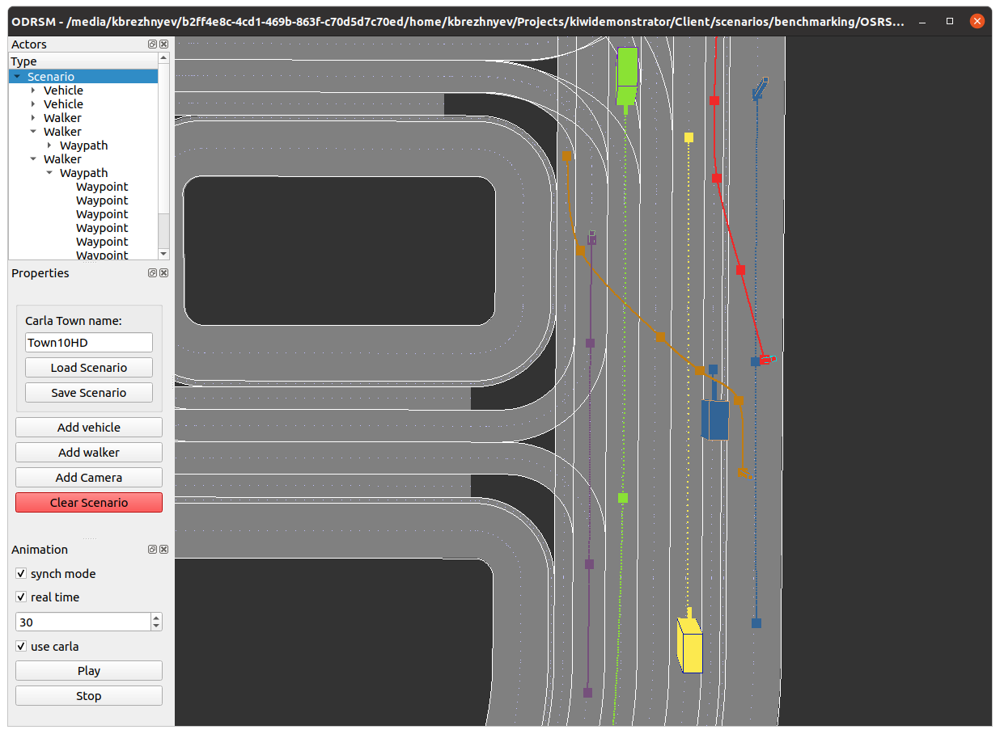

# What is ODRScenariomaker
The ODRScenario maker is a GUI application for building scenarios that can be played back in Carla-simulator.

# Pulling code
Pull code and update the submodules as follows:
<pre>
git clone https://git.altran.de/shared/odrscenariomaker.git
git submodule update --init --force --remote --recursive
</pre>
The ODRSM is using following submodules:
* TinyXML
* ODRParser (depends on TinyXML)
* XodrBuilder (depends on ODRParser)
* Yaml-cpp
* libQGLViewer

The following is the tree you will have after download:
<pre>
.
├── CMakeLists.txt
├── images
│   ├── Add_Vehicle.jpg
|    ...
├── License.txt
├── odr_carla_map
│   ├── ...
├── README.md
└── src
    ├── Actor.cpp
    ├── Actor.h
    ├── ActorProps.cpp
    ├── ActorProps.h
    ├── Camera.cpp
    ├── Camera.h
    ...
    ├── Waypath.h
    ├── WaypathProps.cpp
    ├── WaypathProps.h
    ├── Waypoint.cpp
    ├── Waypoint.h
    ├── WaypointProps.cpp
    ├── WaypointProps.h
    ├── World3D.cpp
    └── World3D.h
...
</pre>

# Configuration.
Run cmake with following flags, otherwise use ccmake to set up the flags:
<pre>
cmake .. -DCMAKE_BUILD_TYPE=Release -DUSE_CARLA=ON -DCARLA_PATH=/absolute/path/to/carla
</pre>
In case there is no carla repo installed and/or no cpp client libraries are built, use following command:
<pre>
cmake .. -DCMAKE_BUILD_TYPE=Release -DUSE_CARLA=OFF
</pre>
In case Debug configuration is needed use Debug flag instead.
 
Running configuration will checkout proper commits for TinyXML (7.0.0) and libQGLViewer (2.7.2) and build the libQGLViewer library. The libQGLViewer librariy is an open source Qt-based GUI framework for handy making GUI applications with 3D views. The former versions of libQGLViewer were based on Qt5 and required consequent running qmake and make commands, so no native cmake subfolder integration was provided. Starting upper versions (~2.9) they changed to cmake configuration but at the same time started to use Qt6. So libQGLViewer is now checked at v2.7.2 and built ouside the cmake configuration system (i.e. is not included as subfolder).

# Dependencies
* cmake
* git
* qt5-default
* libeigen3-dev
* libpng-dev
* libtiff-dev

# Build
Building as usual is make by running make command:
<pre>
make
or
make -j
</pre>

# Installation
Installation is possible by running
<pre>
sudo make install
</pre>
However this is discouraged because no proper uninstall is guaranteed. In case you need to install ODRSM make debian package and install it:
<pre>
cpack (from release or debug folder)
sudo apt install -f ./ODRScenarioMaker-1.0-Linux.deb
</pre>
The **-f** flag will install the required dependencies. The debian package file can be also used to distribute the application.

# Distribution
## Debian package
As was mentioned in Installing section one way to prepare a distribution is to make a debian package:
<pre>
cpack
</pre>
## AppImage
To deploy application you can use the utility from the AppImage familiy:
<pre>
/path/to/linuxdeploy-x86_64.AppImage -e ./ODRScenarioMaker --appdir=./ODRSM
</pre>
The linuxdeploy can be downloaded as ready-to-use application. The linuxdeploy collects all dependencies into lib folder (default destination) and set the RPATH of the executable (ODRScenarioMaker) accordingly.

# Run application
## Open and populate scenario.
<pre>
ODRScenarioMaker /path/to/file.xodr (if installed)
./ODRScenarioMaker /path/to/file.xodr (if not installed)
</pre>

 
**Press H for help**. This Help Dialog is provided by libQGLView and lists most of the mouse and keyboard combinations. Some of them are overwritten or disabled (ex. Esc is disabled to avoid quitting on press). Read about navigation in the Mouse tab of the help Window. Use Shift to pick up objects (left mouse click) and to set rotation pivot (right mouse click). Some useful keys are F, A and G.  

When you open the ODRScenarioMaker there will be only one element available: Scenario. The scenario can be loaded, saved, cleaned or can be populated with Actors: Vehicles, Walkers and Sensors (now only Cameras). Adding Actor will place it in (0,0,0) of CS first. The Vehicles and Walkers **cannot be moved with mouse** to position them! To set position of Vehicle or Walker you will need to add Waypath to them and then to add Waypoints to the Waypaths. Cameras on the contrary can be set with mouse click since they dont have Waypaths (they dont move on their own). However cameras can be created on an active Vehicle or Walker (i.e. attached to an Vehicle or Walker) and hence be travelling in the scene. The location of Camera is always in relative CS (either relative to World or relative to Vehicle/Walker). Use Shift+Left Mouse to pick up and move the Waypoints and Sensors.

**USE Ctr+Z and Ctr+Y to undo and redo!!! At the moment the operations only applicable to adding, deleting objects and cleaning scenario.**

## Play back scenario
To play back scenario there are two options available:
* Using carla simulator
* Without carla simulator (ex. if no carla simulator is installed)
To toggle between the two modies check the **use carla** flag.

**To watch any animation, you need to make sure that the Waypoints have non-zero speed**
When the play back is used with carla simulator the simulator must be running (watch below video with carla simulator). Start carla simulator
<pre>
./CarlaUE4.sh
</pre>
Check the **use carla** flag and press "play" button.
Playing back using carla simulator may disclose some set-up problems, for ex. some Actors are not spawned becase invalid spawn points were selected, or the path is broken by some static object which causes an Actor (usually Pedestrian) to stop in the middle of the path, etc., i.e. those problem you would not observe playing back without carla simulator.

**Specify the town name in the "Carla Town Name" field in case you want to work with specific town!!!** Usually XODR loaded on start of ODRSM should fit the loaded town. If the field is left empty no town will be loaded and ODRSM will proceed with the currently loaded carla town. Loading XODR on start of ODRSM can be changed in future (ex. can be selected as an option like Carla town), however for this some changes in class architecture are needed.

## Saving XOSC file and playing back with scenario runner.
Once the Scenario is set up and tested (eventually with carla simulator) the sceanrio can be saved. Now saving scenario will generate several files, one of them is .xosc file. This file can be played back with scenario-runner:
<pre>
python3 scenario_runner.py --openscenario /path/to/scenario.yaml.xosc
</pre>

## Loading scenarios
At the moment the ODRSM is using its own syntax (yaml file) to read/load the sceanrios. **XOSC cannot be used to read the scenario now**. Ideally that ODRMS only deals with XOSC files: both for reading and writing. This may be one of the next TODOs. Example of the scenario file can be loaded now into ODRSM:
<pre>
type: Scenario
townname: ""
rosbagfile: ""
rosbagoffset: 0
components:
  - type: Vehicle
    name: vehicle.audi.a2
    color:
      r: 50
      g: 100
      b: 150
    components:
      - type: Waypath
        components:
          - type: Waypoint
            location:
              x: -8
</pre>

# Demos

## Adding Vehicle

## Adding Cameras

## Adding Walker

## Undo-redo (only for adding and deleing actors now)

## Running with Carla simulator

# Download
Debian installation package for Ubuntu 20.04 
[debian-ubuntu-20.04](resources/ODRScenarioMaker-1.0-Linux.deb)
