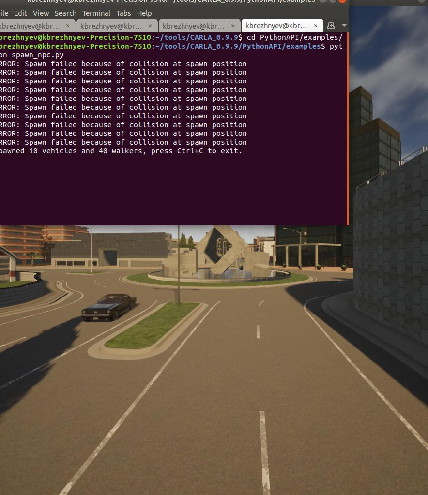
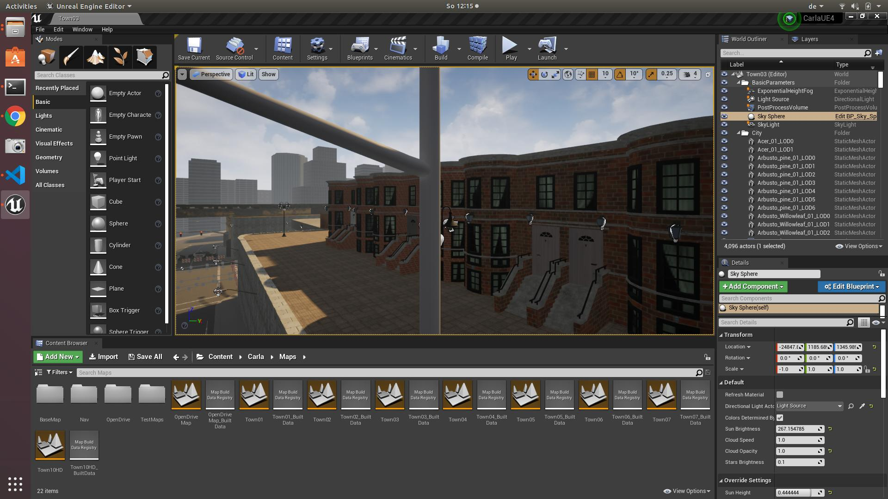
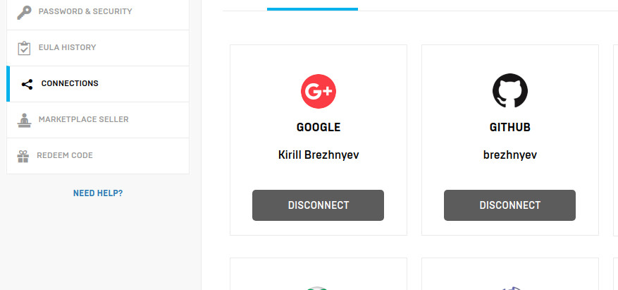
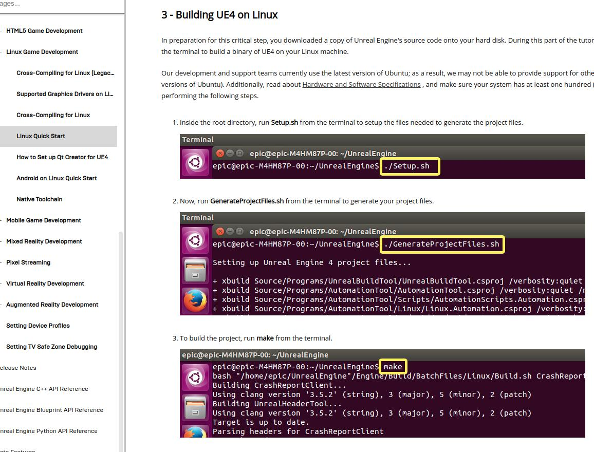
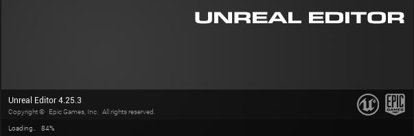
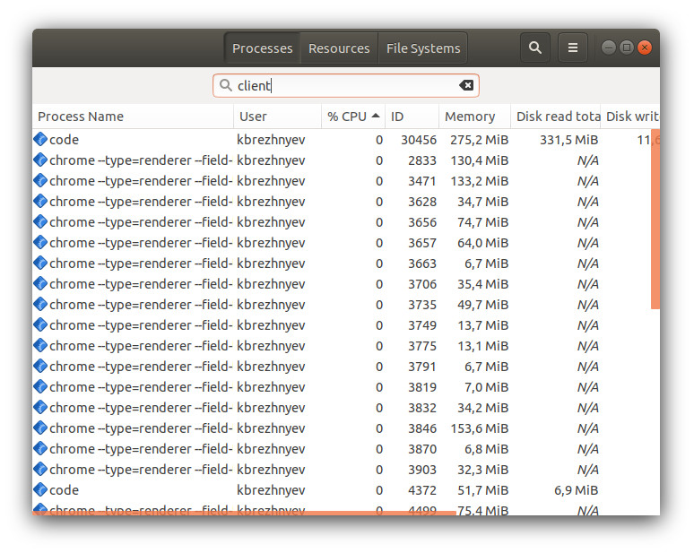
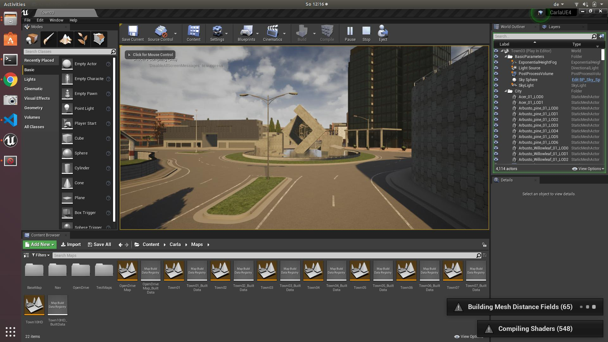
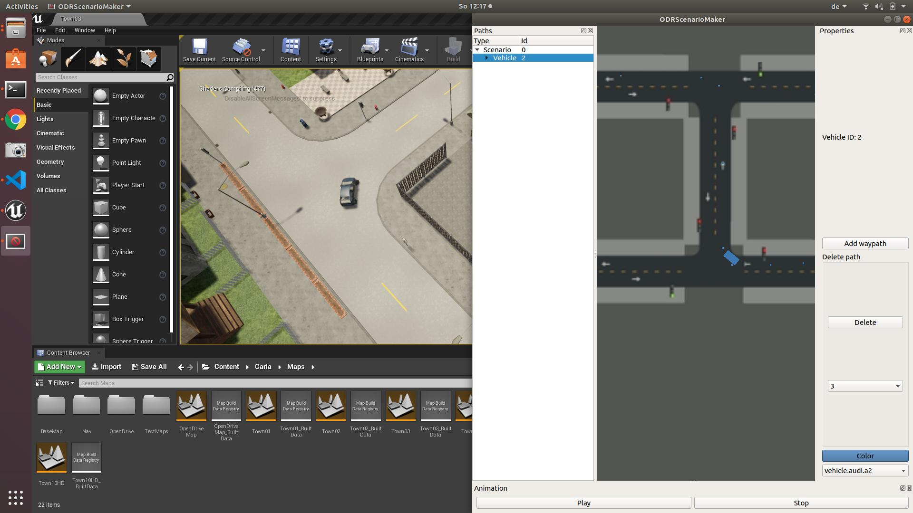

# Alternatives to compile/start Carla 0.9.9 and the Examples/CppClient/ODRScenarioMaker. 

There are some alternatives to start working with carla and the clients to it. In any of the alternatives the following steps are suggested:
1. After cloning the Carla repo checkout the version 0.9.9 since the higher versions have bugs and crash for C++ clients.
2. Apply the patch.txt. This is optional and may be skipped. This is apparently a bug in the Carla tag 0.9.9. This bug will NOT produce a crash BUT will make the cars "blind to see" the walkers **on (re)loading a map** which causes too many accidents. This bug is reported as merge request to the main Carla branch. However before the request is merged there is no handy way to provide this change other than using the patch.

## Using standalone Carla engine.
This is a relative easy way to quickly start working with Carla. Using this way will not require installation of lots of dependancies the legacy installation needs (ex. clang and ninja).
1. Install the Carla Engine (server). Download a pre-compiled ready-to-use standalone Carla engine from the official carla releases: https://github.com/carla-simulator/carla/releases: CARLA_0.9.9.tar.gz unpack and start ./CarlaUE4.sh. This should run the Carla as a standalone application. You can navigate the scene. Also you can start some scripts from PythonAPI/examples, ex. spawn:  
  
1. Build the C++ libraries (carla_client.so and carla_client_debug.so) to "talk" with the Carla Engine.  
1.1. Download rpclib. git clone https://github.com/rpclib/rpclib.git, build as usual and sudo checkinstall.  
1.2 Download recastnavigation. git clone https://github.com/carla-simulator/recastnavigation.git, build as usual and sudo checkinstall
**Important!** the recastnavigation exists as forks in different repos in internet. **Important to use the one for carla + "recast_builder" branch.**
 Build with -fPIC flag (this may be needed if the carla library is built as shared in p.5).  
1.3. Download boost_1_73_0 as zip package. Start ./bootstrap.sh and then ./b2 to build the libs. Do NOT install, since this may cause conflict with existing boost (1.65 is standard for Ubuntu18)  
1.4. Download sdl: sudo apt install libsdl2-2.0-0  
1.5. Clone the carla: git clone https://github.com/carla-simulator/carla.git, checkout version 0.9.9  
* mkdir Build (if does not exist, beware of capital **B**build)
* cd Build  
* touch CMakeLists.txt.in (needed by the CMakeLists.txt) 
* copy Version.h into ./LibCarla/source/carla 
* cmake .. -DCMAKE_BUILD_TYPE=Client -DCMAKE_CXX_STANDARD_INCLUDE_DIRECTORIES=/home/kbrezhnyev/BUILDS/boost_1_73_0  
where the DCMAKE_BUILD_TYPE can be Server (not relevant in our case) and
DCMAKE_CXX_STANDARD_INCLUDE_DIRECTORIES the path to the boost_1_73_0

## Legacy way.
The legacy way is laid out in the Carla official site:  
https://carla.readthedocs.io/en/latest/build_linux/  
Here is the copy-paste from the unfolded "Show command lines to build on Linux". Below see the  guidelines to install the UE4Editor. 
<pre>
# Make sure to meet the minimum requirements and read the documentation to understand each step.

# Install dependencies.
sudo apt-get update &&
sudo apt-get install wget software-properties-common &&
sudo add-apt-repository ppa:ubuntu-toolchain-r/test &&
wget -O - https://apt.llvm.org/llvm-snapshot.gpg.key|sudo apt-key add - &&
sudo apt-add-repository "deb http://apt.llvm.org/$(lsb_release -c --short)/ llvm-toolchain-$(lsb_release -c --short)-8 main" &&
sudo apt-get update

# Additional dependencies for Ubuntu 18.04.
sudo apt-get install build-essential clang-8 lld-8 g++-7 cmake ninja-build libvulkan1 python python-pip python-dev python3-dev python3-pip libpng-dev libtiff5-dev libjpeg-dev tzdata sed curl unzip autoconf libtool rsync libxml2-dev libxerces-c-dev &&
pip2 install --user setuptools &&
pip3 install --user -Iv setuptools==47.3.1

# Additional dependencies for previous Ubuntu versions.
sudo apt-get install build-essential clang-8 lld-8 g++-7 cmake ninja-build libvulkan1 python python-pip python-dev python3-dev python3-pip libpng16-dev libtiff5-dev libjpeg-dev tzdata sed curl unzip autoconf libtool rsync libxml2-dev libxerces-c-dev &&
pip2 install --user setuptools &&
pip3 install --user -Iv setuptools==47.3.1 &&
pip2 install --user distro &&
pip3 install --user distro

# Change default clang version.
sudo update-alternatives --install /usr/bin/clang++ clang++ /usr/lib/llvm-8/bin/clang++ 180 &&
sudo update-alternatives --install /usr/bin/clang clang /usr/lib/llvm-8/bin/clang 180

# Get a GitHub and a UE account, and link both.
# Install git.

# Download Unreal Engine 4.24.
git clone --depth=1 -b 4.24 https://github.com/EpicGames/UnrealEngine.git ~/UnrealEngine_4.24
cd ~/UnrealEngine_4.24

# Download and install the UE patch
wget https://carla-releases.s3.eu-west-3.amazonaws.com/Linux/UE_Patch/430667-13636743-patch.txt ~/430667-13636743-patch.txt
patch --strip=4 < ~/430667-13636743-patch.txt

# Build UE
./Setup.sh && ./GenerateProjectFiles.sh && make

# Open the UE Editor to check everything works properly.
cd ~/UnrealEngine_4.24/Engine/Binaries/Linux && ./UE4Editor

# Clone the CARLA repository.
git clone https://github.com/carla-simulator/carla

# Get the CARLA assets.
cd ~/carla
./Update.sh

# Set the environment variable.
export UE4_ROOT=~/UnrealEngine_4.24

# make the CARLA server and the CARLA client.
make launch
make PythonAPI

# Press play in the Editor to initialize the server, and run an example script to test CARLA.
cd PythonAPI/examples
python3 spawn_npc.py
</pre>

Starting with  **make launch** may take a lot of time if started right after the build first time. Use **make launch-only** to avoid rebuilding later. Checkout all options starting **make** without arguments.

  

## Installing UE4Editor

To install UE4Editor one must have an account in Epic.
1. One must have an account in git.
1. Go to https://www.epicgames.com/account/personal -> connection. Choose git. Follow the Connection Wizzard (check e-mail may be needed). After the connection is established you will have access to the UE4 git repo.
1. git clone https://github.com/EpicGames/UnrealEngine.git
1. Follow the instructions: https://docs.unrealengine.com/en-US/Platforms/Linux/BeginnerLinuxDeveloper/SettingUpAnUnrealWorkflow/index.html. Beware to run "make" without the "-j" key. The build process may take long (around one hour).
1. start the editor <pre>~/BUILDS/UnrealEngine/Engine/Binaries/Linux$ ./UE4Editor</pre>
1. starting editor for the first time may take long, so wait.

  
  
Starting as mentioned above (cd ~/UnrealEngine_4.24/Engine/Binaries/Linux && ./UE4Editor)  

The Build folder after running "make rebuild" and "cmake .." as above:
<pre>
kbrezhnyev@kbrezhnyev-Precision-7510:~/BUILDS/carla/Build$ tree . -L 1
.
├── boost-1.72.0-c8-install
├── CMakeCache.txt            // this is generaged by "cmake .."
├── CMakeFiles                // this is generaged by "cmake .."
├── cmake_install.cmake       // this is generaged by "cmake .."
├── CMakeLists.txt.in
├── gtest-1.8.1-c8-libcxx-install
├── gtest-1.8.1-c8-libstdcxx-install
├── LibCarla                  // this is generaged by "cmake .."
├── libcarla-client-build.debug
├── libcarla-client-build.release
├── libcarla-server-build.debug
├── libcarla-server-build.release
├── LibCppToolChain.cmake
├── LibStdCppToolChain.cmake
├── llvm-8.0-install
├── Makefile
├── recast-cdce4e-c8-install
├── rpclib-v2.2.1_c2-c8-libcxx-install
├── rpclib-v2.2.1_c2-c8-libstdcxx-install
└── test-content
</pre>

Suggested is to run "make rebuild" **at least once** to let the configuration process download all necessary components. After it use the usual "cmake .." command from Build folder. It is also possible to run "cmake .." from a different folder, however the configuration process will require the CMakeLists.txt.in file which make be generated empty "touch CMakeLists.txt.in" 
**The "make rebuild" and "cmake .." commands will place the resulting libcarla_client_debug.a and libcarla_client.a libraries into different folders!**
<pre>
kbrezhnyev@kbrezhnyev-Precision-7510:~/BUILDS/carla/Build$ find . -iname libcarla_client_debug.a
./libcarla-client-build.debug/LibCarla/cmake/client/libcarla_client_debug.a          // built with the "make rebuild" command
./LibCarla/cmake/client/libcarla_client_debug.a                                      // build "with cmake .." command
</pre>

# Building Client application(s)
The client applications majorly signle file applications created for testing the Carla client coding, like setting weather, map (Townxx) etc. The PPPScene is the most advance one, it is storing the RGB, Lidar, SemSeg images onto disk. Potentially the PPPScene code can go into the ODRScenariomaker GUI application (see below) to extend the functionalities.  
To build the Client applications cd ppp_simulation/cpp:
1. Make include directory with mkdir include. There should be two soft links in the include folder:  
* ln -s /path/to/carla_repo/Build/boost-1.72.0-c8-install/include
* ln -s /path/to/carla_repo/LibCarla/source/carla
2. Make lib folder. There should be the following soft links int the lib folder:  
* ln -s /path/to/carla_repo/Build/boost-1.72.0-c8-install/libs/ boost
* ln -s /path/to/carla_repo/Build/<libcarla-client-build.debug>/LibCarla/cmake/client carla_debug (libcarla-client-build.debug is optional and is relevant if the Carla Legacy way is used)
* ln -s /path/to/carla_repo/Build/<libcarla-client-build.release>/LibCarla/cmake/client carla_release (libcarla-client-build.release is optional and is relevant if the Carla Legacy way is used)
3. Make the debug and/or release directories:
* Debug:   mkdir debug, cd debug, cmake .. -DCMAKE_BUILD_TYPE=Debug
* Release: mkdir release,  cd release, cmake .. -DCMAKE_BUILD_TYPE=Release
4. Start the ./CarlaUE4.sh and then ./clientExample in two different terminals

Example of the files structure in the ppp_simulation/cpp folder:
<pre>
.
├── CMakeLists.txt
├── configuration.yaml
├── debug
├── include
│   ├── boost -> /home/kbrezhnyev/BUILDS/carla/Build/boost-1.72.0-c8-install/include/
│   └── carla -> /home/kbrezhnyev/BUILDS/carla/LibCarla/source/
├── lib
|   |── boost -> /home/kbrezhnyev/tools/boost_1_73_0/libs/
│   ├── carla_debug -> /home/kbrezhnyev/BUILDS/carla/Build/LibCarla/cmake/client
│   ├── carla_release -> /home/kbrezhnyev/BUILDS/carla/Build/LibCarla/cmake/client
│   └── lib -> /home/kbrezhnyev/BUILDS/carla/Build/boost-1.72.0-c8-install/lib/
├── originalExample.cpp
├── patch.txt
├── PPPScene.cpp
├── PPPScene.h
├── ppp_sim_config.h
├── ppp_sim_start.cpp
├── release
└── test_spawn.cpp
</pre>

# Building ODRScenariomaker
The ODRScenario maker is a GUI application for building scenarios that can run in Carla. The application consists of two parts: GUI and the carla-client part. The two are communicating via TCP/IP. This approach has cons and pros, however main reason to split was impossibility to compile Qt and Carla-related classes in one project.  
The Serializer is the class shared by two parts of the application so it is made a library for the client to use it.  
The same issues hold with the soft links: for the Carla-client there should be prepared two folders *include* and *lib*. Here is how the files should look like:  
<pre>
.
├── Actor.cpp
├── Actor.h
├── ActorProps.cpp
├── ActorProps.h
├── Canvas.cpp
├── Canvas.h
├── client
│   ├── CMakeLists.txt
│   ├── include
│   ├── lib
│   └── play.cpp
├── CMakeLists.txt
├── data
│   └── Town02.jpg
├── IPC.cpp
├── IPC.h
├── main.cpp
├── MainWindow.cpp
├── MainWindow.h
├── ODRScenarioMaker
├── release
│   ├── client
│   ├── CMakeCache.txt
│   ├── CMakeFiles
│   ├── cmake_install.cmake
│   ├── libser.a
│   ├── Makefile
│   ├── ODRScenarioMaker
│   ├── ODRScenarioMaker_autogen
│   └── ser_autogen
├── scenario.cpp
├── scenario.h
├── ScenarioProps.cpp
├── ScenarioProps.h
├── Selectable.cpp
├── Selectable.h
├── Serializer.cpp
...
</pre>

# Starting ODRScenarioMaker with standalone Carla Engine
The ODRScenarioMaker is started in a standard was as a standalone application. At this point there is no need to have Carla Engine running, since the ODRScenarioMaker will not need carla during the setup/edditing.  
Select the scenario (Scenario 0) and "Add Vehicle" on the right panel:
  
The Vehicle will be displayed near to the start of the Coordinate System (maybe far away from where the Town map is). Click "A" on the keyboard and zoom in/out to find it:  
  
Add Waypath for the selected Vehicle. Select the newly created Waypath in the tree. Now keeping *Shift* pressed the waypoints may be added (usually along the road):  
  

Another car maybe added with waypaths/waypoints. (Only one waypath will be played back now per vehicle)

After the scenario is prepared the carla engine should be started. Go to the folder with Carla and start Carla with  
**./CarlaEU4.sh**   
The look of Carla on the first start:

  
Another possible view (after first start is complete). Here the properly loaded Map is displayed:  
  

Press **Play**. The two cars (Audi and VW mini bus) will move in opposite directions making two curves: 

  

**KNOWN ISSUES**: closing the ODRScenarioMaker not always closes the TCP connection. So check the "client" application in system to avoid dozens of open TCP connections:

  

# Starting ODRScenarioMaker with UE4Editor
Very similar to the previous procedure, just instead of the standalone Carla the Carla-project should be started as mentioned in the "Legacy Way" from the "carla" folder:  
**make launch-only**
Press "Play" to start the server inside the UE4Editor:  
  
Start "play" in the ODRScenarioMaker:  
  
