# Alternatives to using RoadRunner for creation of XODR and MAPs for Carla

## Using open street maps as basis for Carla Maps

Open Street Maps provide the option "Export" the visible or selected area. The exported file has .osm extension and usually stores the primitive 3D objects with or without texture coordinates and the road metainformation (directions, lanes, junctions, etc):  
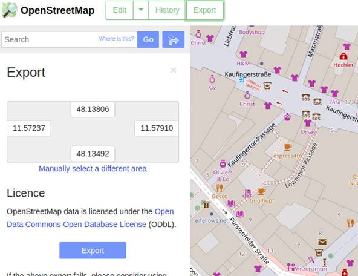  

One of the possibilities to view the exported osm file is to use OSM2World Viewer (http://osm2world.org/download/):  
<pre>
./osm2world.sh --gui --config standard.properties
</pre>
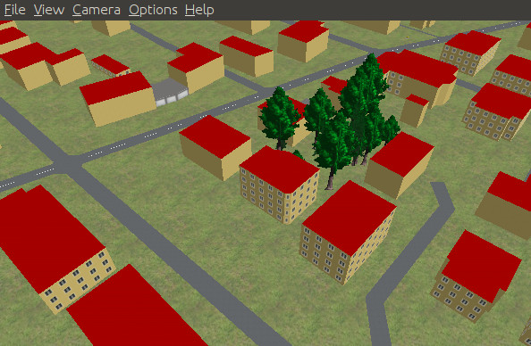  

Edditing the OSM files is possible with some editors, ex. netedit from SUMO:
<pre>./netedit</pre>
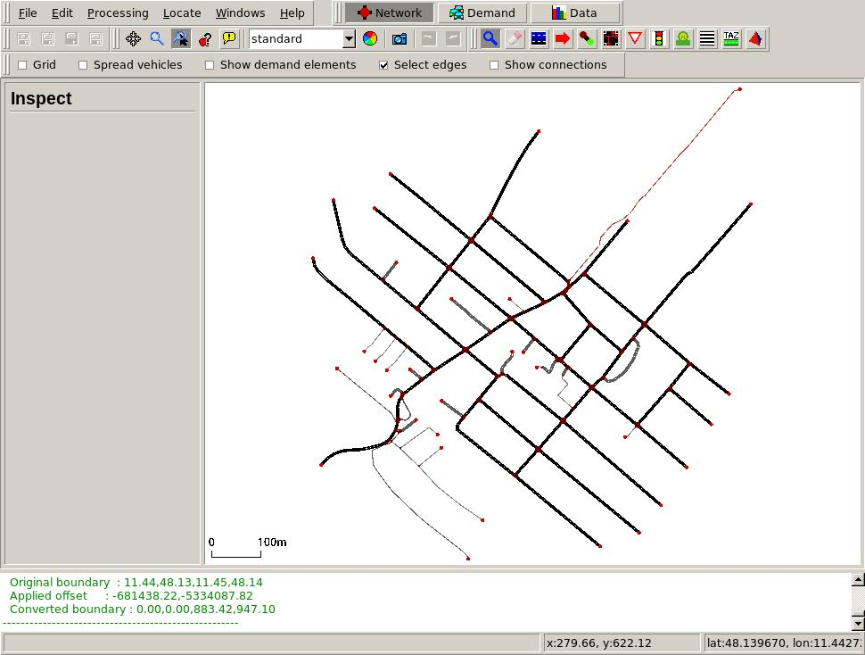  

Here is a list of OSM editors:  
https://wiki.openstreetmap.org/wiki/Comparison_of_editors  

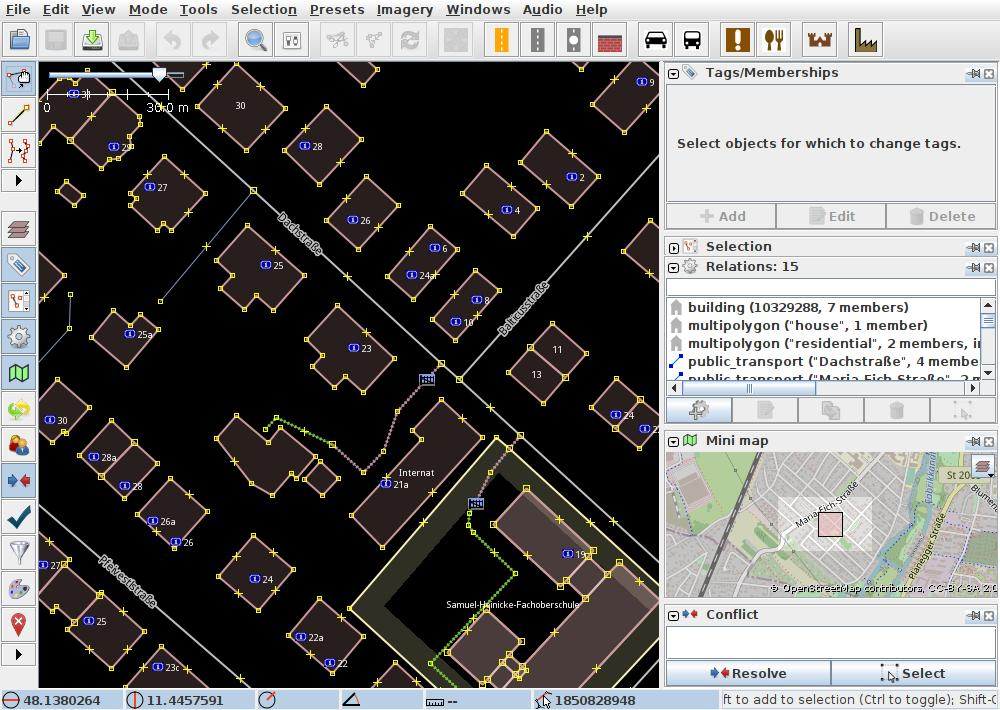  

The OSM2World viewer allows exporting the scene into .obj file/folder. Good idea to export the scene into a folder, then all files of the scene will be in one isolated folder:  
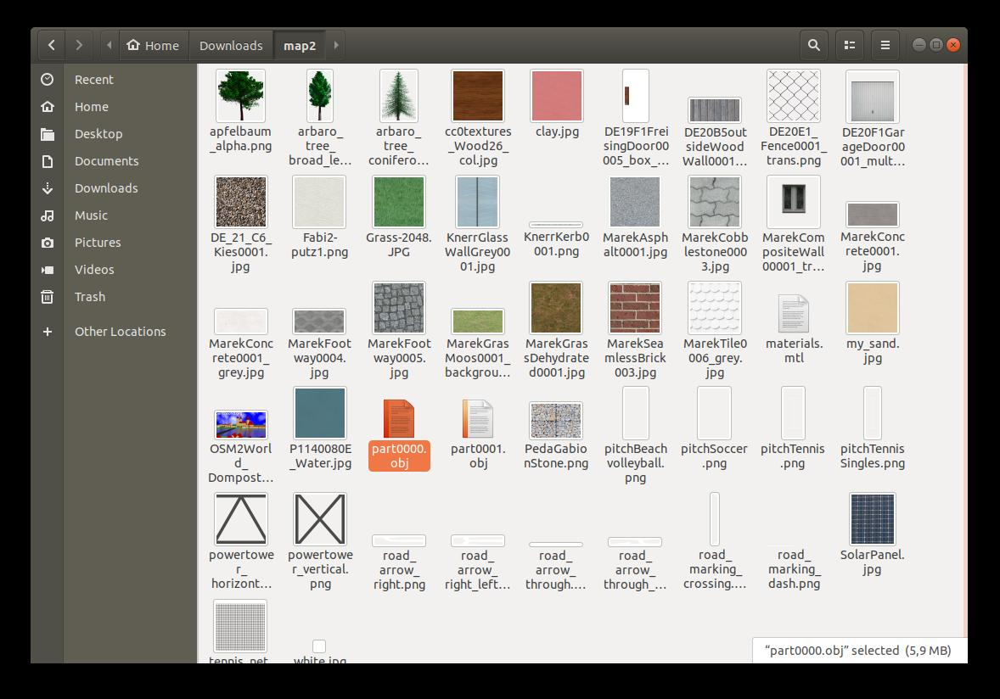  
The OBJ file can be imported into the UE4Editor to be refined/modified.

## Installing UE4Editor

To install UE4Editor one must have an account in Epic.
For Windows users installation is just downloading the .msi file and starting it.  
For Linux users the process a bit more complicated:
1. One must have an account in git.
1. Go to https://www.epicgames.com/account/personal -> connection. Choose git. Follow the Connection Wizzard (check e-mail may be needed). After the connection is established you will have access to the UE4 git repo.
1. git clone https://github.com/EpicGames/UnrealEngine.git
1. Follow the instructions: https://docs.unrealengine.com/en-US/Platforms/Linux/BeginnerLinuxDeveloper/SettingUpAnUnrealWorkflow/index.html. Beware to run "make" without the "-j" key. The build process may take long (around one hour).
1. start the editor <pre>~/BUILDS/UnrealEngine/Engine/Binaries/Linux$ ./UE4Editor</pre>
1. starting editor for the first time may take long, so wait.
1. At this point it is not very clear how to proceed. The OBJ files may be imported into Editor with File -> "import into Level". In the above example the OSM2World Viewer exported two obj files (part0000.obj and part0001.obj). So the two may be imported (one after the other).
1. **The final goal is to have the .map, .umap and .uasset files properly into the Carla engine.**

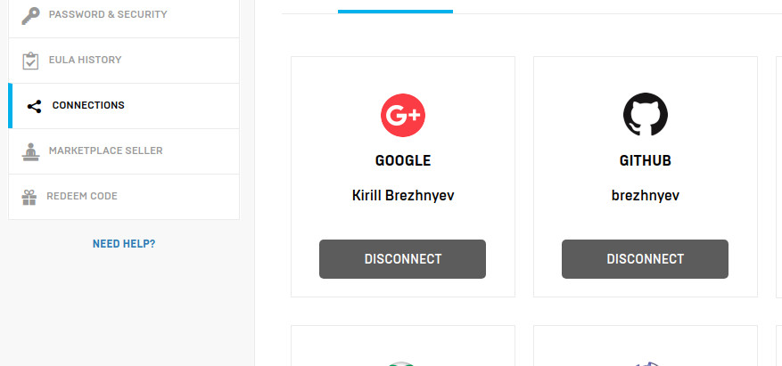  
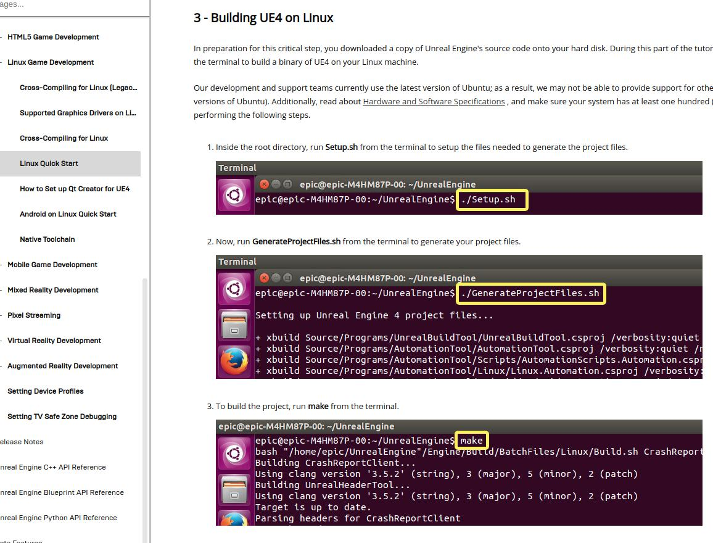  
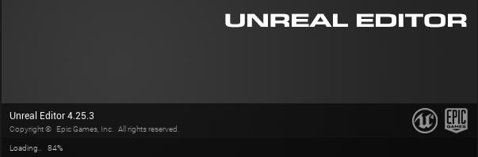  
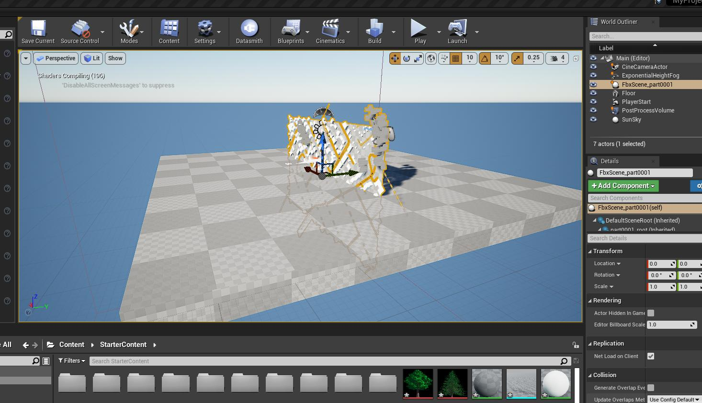  
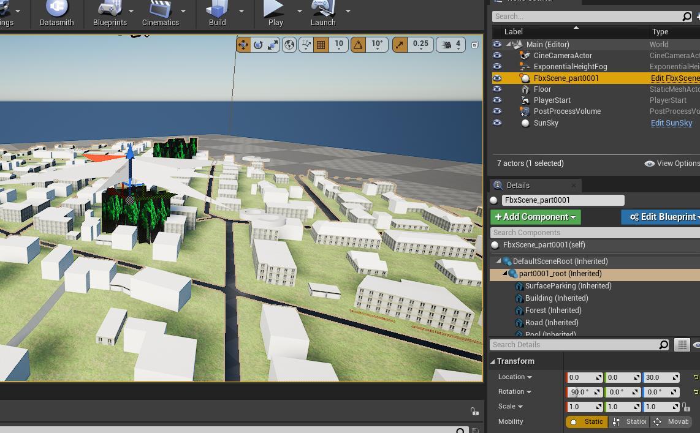  
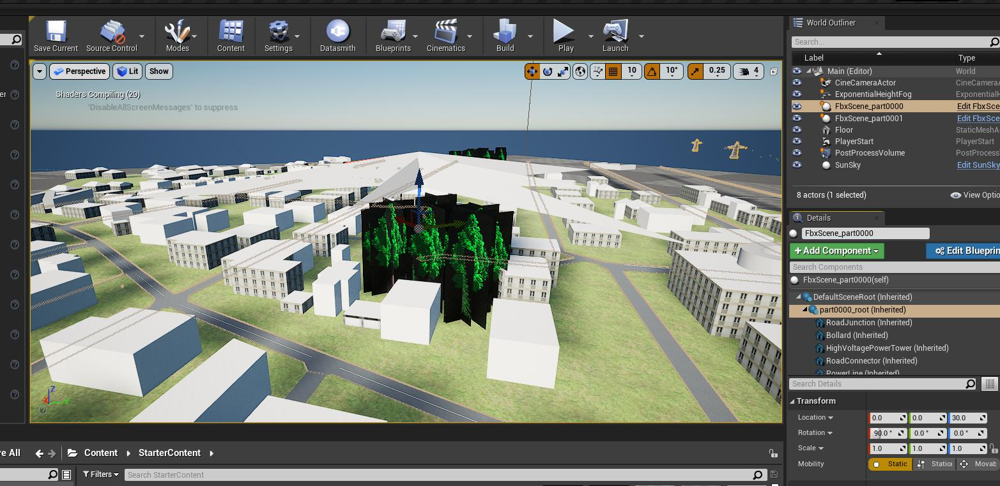  

Extra references:  
* https://docs.unrealengine.com/en-US/Platforms/Linux/BeginnerLinuxDeveloper/SettingUpAnUnrealWorkflow/index.html
* https://github.com/carla-simulator/carla/issues/1998
* https://github.com/carla-simulator/carla/issues/1015
* https://docs.unrealengine.com/en-US/Engine/Landscape/Creation/index.html?utm_source=editor&utm_medium=docs&utm_campaign=tutorials
* https://sumo.dlr.de/docs/netedit.html
* https://sumo.dlr.de/docs/netconvert.html